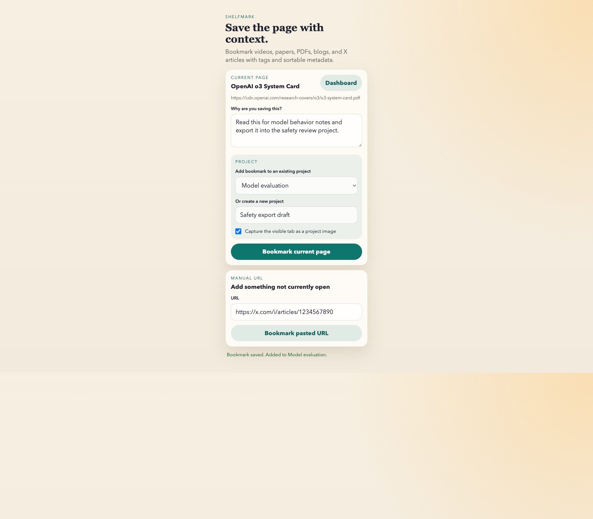
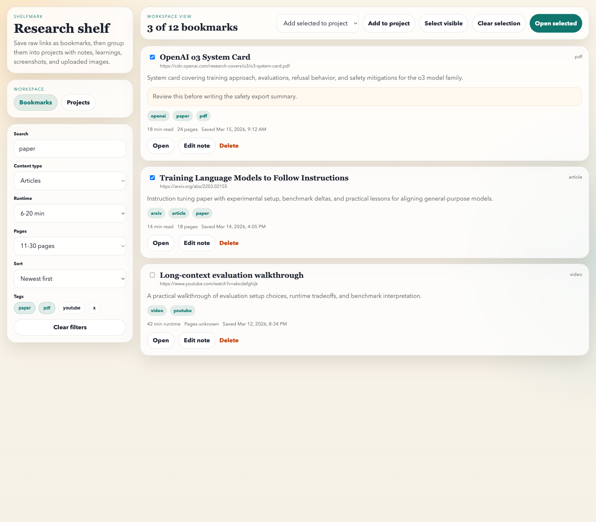
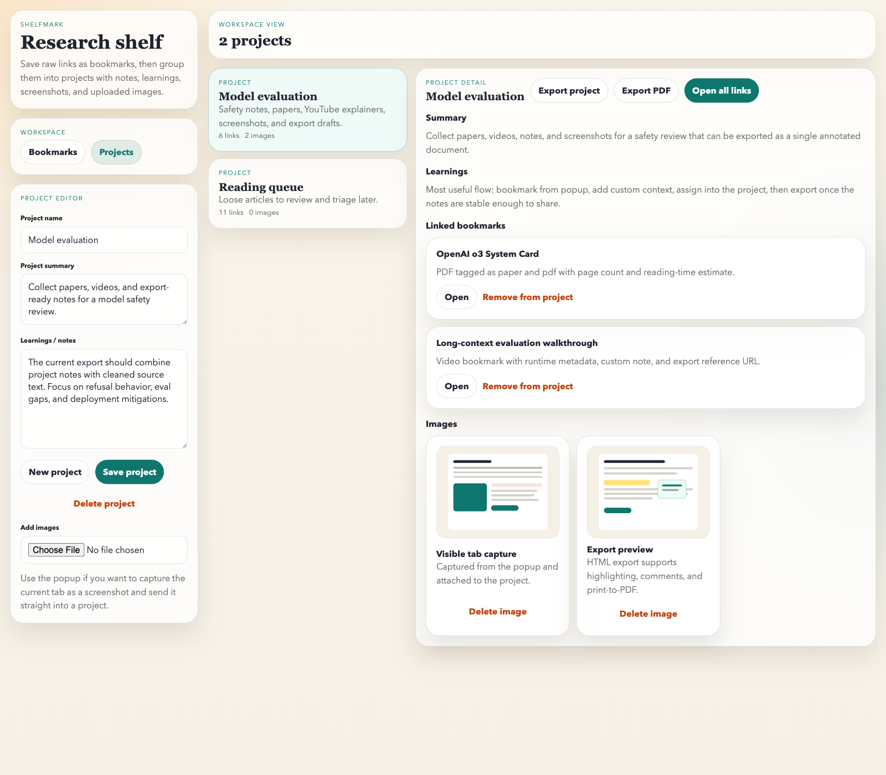

# Shelfmark

Shelfmark is a Chrome extension for saving links with context, organizing them into projects, and exporting the result as a readable research packet.

It is built for mixed-source reading workflows where the things you save are not all the same shape:

- YouTube videos
- X posts and X articles
- blog posts and newsletters
- papers and PDFs
- general web pages

Instead of acting like a plain browser bookmark manager, Shelfmark adds metadata, tags, notes, filters, projects, screenshots, and export.

## What It Does

- Save the current tab or a pasted URL from the popup
- Extract a title and summary
- Auto-tag saved content with signals such as `youtube`, `video`, `x`, `article`, `blog`, `pdf`, and `paper`
- Estimate runtime for videos and reading time for text-heavy content
- Estimate page counts for PDFs when possible
- Add your own note at save time
- Group bookmarks into projects
- Add project summaries, long-form learnings, screenshots, and uploaded images
- Filter and sort bookmarks by content type, tags, runtime, pages, and search terms
- Export a project into a single formatted HTML document
- Print that HTML export to PDF
- Highlight exported text and attach comments in the exported document

## Screenshots

### Popup: save the current page with notes and project assignment



### Bookmark workspace: filter, sort, tag, and open saved links



### Projects workspace: write notes, collect assets, and export



## Install In Chrome

1. Open `chrome://extensions`.
2. Turn on **Developer mode**.
3. Click **Load unpacked**.
4. Select the local `shelfmark` project folder that contains `manifest.json`.
5. Pin the extension if you want quick access from the toolbar.

If you already loaded the extension and pulled code changes later:

1. Go back to `chrome://extensions`.
2. Find `Shelfmark`.
3. Click **Reload**.

If Chrome keeps showing an old icon, remove the extension once and load it again. Chrome caches extension assets aggressively.

## How To Use It

### 1. Save a bookmark

Open any page and click the Shelfmark popup.

You can:

- bookmark the active tab
- paste a URL manually
- add a custom note explaining why you saved it
- attach the bookmark to an existing project
- create a new project during save
- capture the visible tab as a screenshot into that project

### 2. Review bookmarks in the dashboard

Open the dashboard from the popup.

The Bookmarks view lets you:

- search across title, summary, note, and tags
- filter by content type
- filter by runtime
- filter by page count
- filter by tags
- sort by newest, oldest, title, runtime, or pages
- select multiple bookmarks and open them together
- bulk-assign selected bookmarks to a project

### 3. Build a project

Switch to the Projects view to manage a project as a research container.

Each project supports:

- a project name
- a summary
- long-form learnings or notes
- linked bookmarks
- uploaded images
- screenshots captured from the popup

This is the workspace you use when you want to turn scattered links into something closer to a working reading folder.

## Export Workflow

Each project can be exported in two ways:

- `Export project`: creates a single self-contained HTML document
- `Export PDF`: opens a print-ready export and triggers the browser print flow

The HTML export includes:

- project title
- project summary
- your written learnings and notes
- linked bookmark titles
- bookmark notes
- scraped source content where extraction succeeds
- reference URLs for each source
- inline highlighting and comments in the exported file

Recommended flow:

1. Save links into a project
2. Add your own notes and learnings
3. Export the project to HTML
4. Review, highlight, and comment in the export
5. Print or save as PDF

## Content Classification And Tagging

Shelfmark uses URL and page metadata heuristics to classify content.

Examples:

- YouTube links get `youtube` and `video`
- X links get `x`
- X article URLs get `x` and `article`
- PDF links get `pdf`
- paper-like sources may get `paper`
- non-paper articles may get `article` and `blog`

The metadata pipeline is best-effort. It works well for many standard pages, but it is still heuristic-based rather than site-specific.

## Storage Model

This version is local-first.

- Bookmarks and projects are stored in `chrome.storage.local`
- Images and screenshots are stored in extension local storage
- There is no backend account sync in the current build

That means:

- your data is local to the browser profile where the extension is installed
- large image collections will eventually hit Chrome storage limits
- Chrome sync is not being used for project data because its quota is too small for this use case

## Limits And Practical Notes

- Metadata extraction is best-effort
- Export scraping is best-effort
- heavily scripted pages may export partial content
- some PDFs may export only partial text
- `chrome://` pages and some restricted tabs cannot be inspected normally by extensions
- screenshots and uploaded images increase storage usage quickly

## Local Validation

Basic syntax checks:

```bash
npm run check
```

Project tests:

```bash
npm test
```

## Citation

If you reference or reuse Shelfmark, citation metadata is available in [CITATION.cff](CITATION.cff).

## Repo Notes

Documentation screenshots used in this README live in:

- `docs/screenshots/popup.png`
- `docs/screenshots/bookmarks.png`
- `docs/screenshots/projects.png`

The static demo pages used to generate those screenshots live in:

- `docs/popup-demo.html`
- `docs/bookmarks-demo.html`
- `docs/projects-demo.html`
